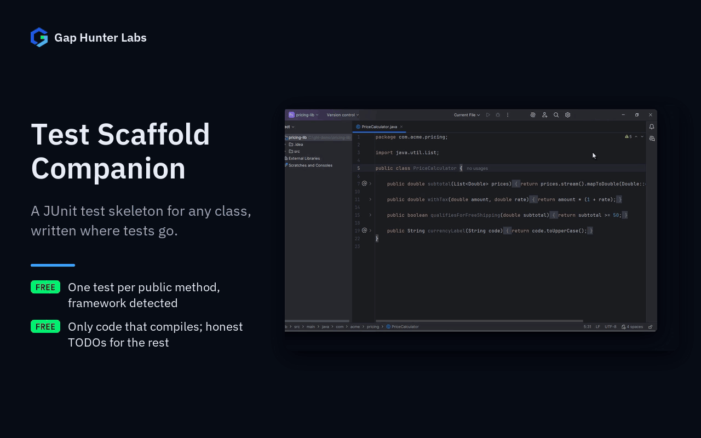

# Test Scaffold Companion

IntelliJ-family plugin (IntelliJ IDEA, Android Studio, and any
IntelliJ-based IDE that bundles the Java and Kotlin plugins). Generates
a compiling **Kotlin** JUnit test skeleton for a Java or Kotlin class
(your test sources need Kotlin) — one test method per public method,
with your project's own test framework detected and imported correctly.



On its own:
[Generate a test](docs/media/01-generate.gif)

## Why it exists

The free alternatives in this space have the same defect, reported by
their own users: generated code that doesn't compile or a test that
"passes" without asserting anything real. From those plugins' own
JetBrains Marketplace reviews:

- Squaretest: *"I installed this app in a hope it will allow us to get
  our Unit test up to date but after generating a allot of useless,
  non working tests I have very little hope that this tool is of any
  use."*
- TestMe: *"No tests generated. Tests generated didn't pass at all..."*
- JUnitGenerator V2.0: abandoned since 2009–2010, incompatibility and
  encoding bugs never fixed.

None of the free competitors verify the code they generate before
writing it to disk. This plugin does — every generated skeleton is
parsed into an in-memory copy and checked for syntax errors *before*
it's ever offered as something to write (a syntax error writes
nothing). That check is syntax only, so the generator itself only emits
code that compiles: calls go through an `instance` the test declares
(`private lateinit var instance: YourClass`, with a `TODO` to assign
it) and use typed placeholders (`0.0` for a `double`, `""` for a
`String`). Anything it can't call safely — an object argument it would
have to pass as `null`, a generic class — gets an honest `TODO` comment
instead of a broken test. (Before 0.1.3 the calls referenced an
`instance` that was never declared, and a `double` argument got `0`, so
the generated file didn't compile.)

## Why built this way

- **Nothing is written to disk without passing an in-memory validation
  pass first.** Uses `PsiFileFactory.createFileFromText(...)` — the
  file this creates is never connected to the real project directory
  until it's confirmed syntactically valid, so a failed generation
  attempt carries zero risk to your code.
- **Test framework detected by resolving a real marker class against
  your module's own classpath** (JUnit 4, JUnit 5, or TestNG) — never
  a config dropdown, never a guess. If none resolve, the plugin refuses
  to generate rather than producing an import that won't compile.
- **Assertions are only generated when a safe default genuinely
  exists** — `String` and known collection return types get a real
  `assertNotNull`. Everything else (primitives, custom types, `void`)
  gets an honest `TODO` instead of a placeholder assertion that
  compiles but proves nothing.
- **Mocks are optional and never forced.** If Mockito is already on
  your project's classpath, constructor dependencies get real
  `Mockito.mock(...)` fields generated for you. If it isn't, the
  plugin never adds it as a dependency on your behalf — you get a
  plain `instance` variable and a `TODO` to assign it yourself.
- **100% local.** No network call, no account, no telemetry — unlike
  some AI-assisted test generators in this space that send your
  method's code to a third-party API.

## Usage

Right-click a class in the editor or the Project view → **Generate
Test Skeleton**. The generated `<ClassName>Test.kt` file is written to
the class's package under the module's test source root (preferring the
one that mirrors the class's own root, `src/main/java` →
`src/test/java`), creating the package directories if needed, and
opened in the editor. Only a module with no test source root at all
gets the file next to the class. (Before 0.1.3 a missing package
directory under `src/test` sent the test to `src/main`, where JUnit
isn't on the classpath, and the file wasn't opened.)

## Free, forever

Everything above — skeleton generation, framework detection, in-memory
validation, assertion inference, mock field generation — is fully free,
no paywall. This plugin has no confirmed paid competitor with real
complaints in this niche (the free alternatives audited above are all
free); it was built as a deliberate bet rather than the usual
evidence-anchored pick. No monetization plan exists yet — that decision waits for
real usage signal, same discipline already applied to Refactor
Simulator.

## Support

- **Bugs and feature requests:** [GitHub Issues](https://github.com/GapHunterLabs/test-scaffold-companion/issues)
- **Questions, or custom rules for a team's codebase:** **gaphunterlabs@gmail.com**
- **Security vulnerabilities:** report privately as described in [SECURITY.md](SECURITY.md), not in a public issue.
- **Privacy and network behavior:** [PRIVACY.md](PRIVACY.md)

## Development

```
./gradlew test           # unit tests
./gradlew buildPlugin    # generates build/distributions/*.zip
./gradlew verifyPlugin   # checks compatibility against real IDEs
```

## License

Apache-2.0. See `LICENSE`.
